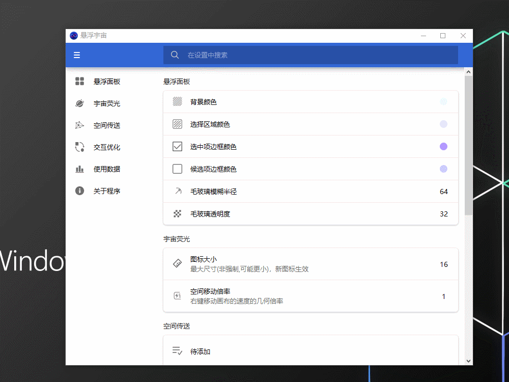
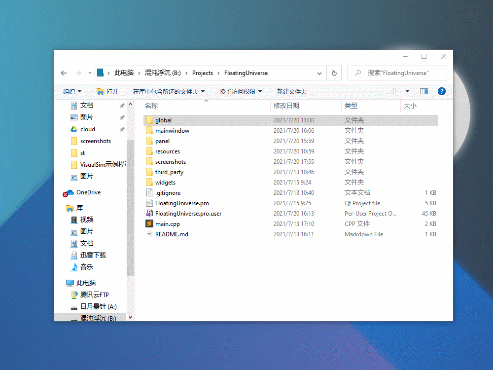
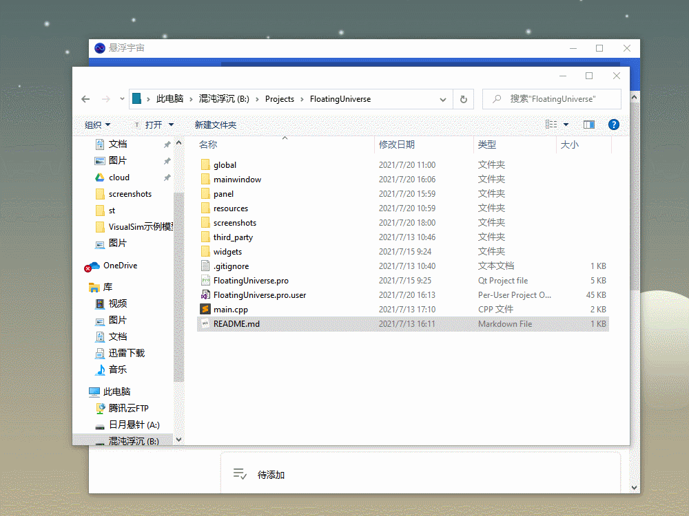
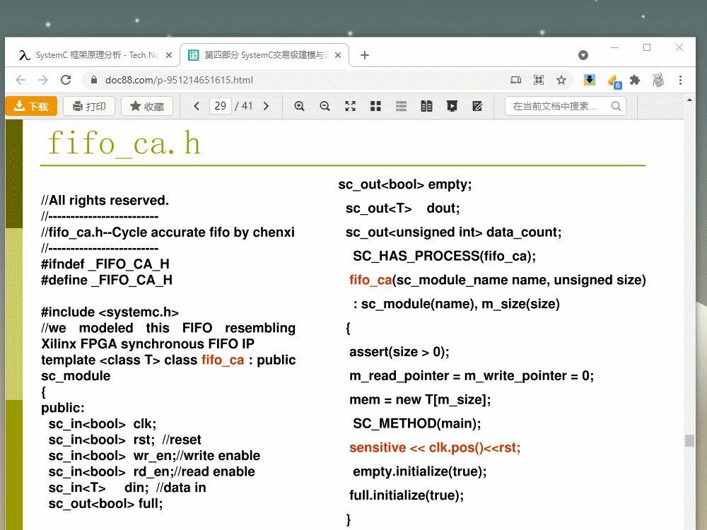
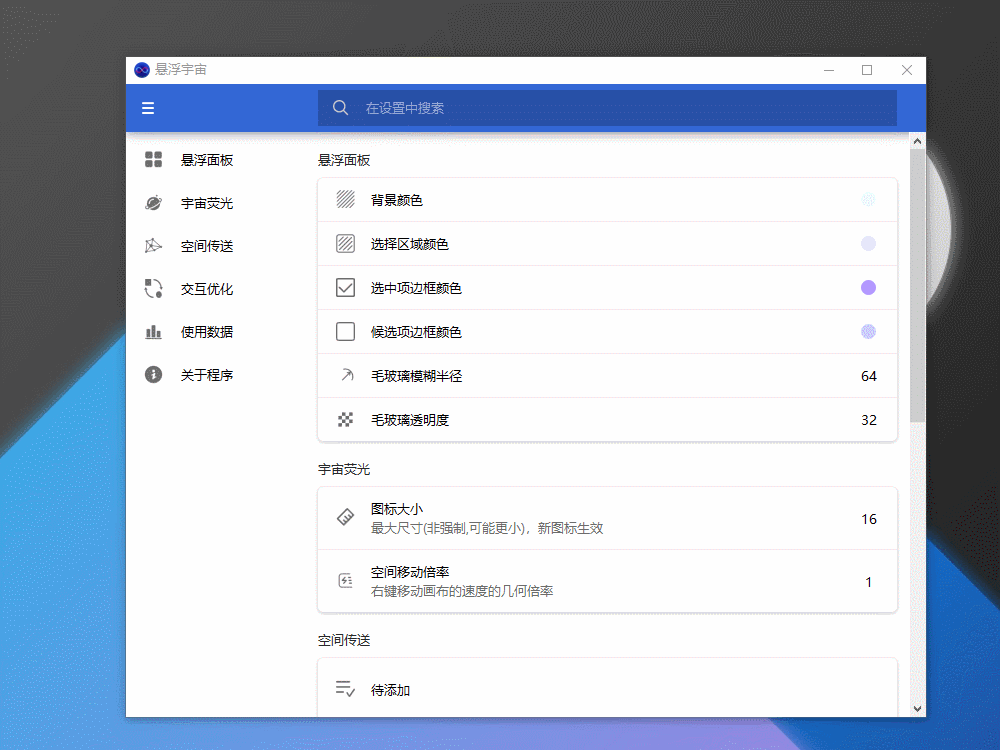
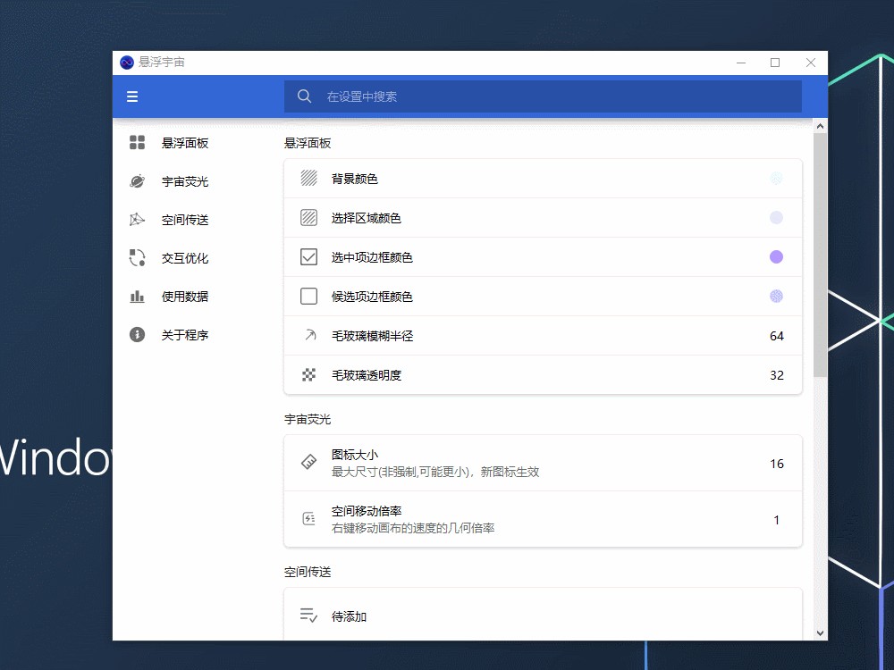
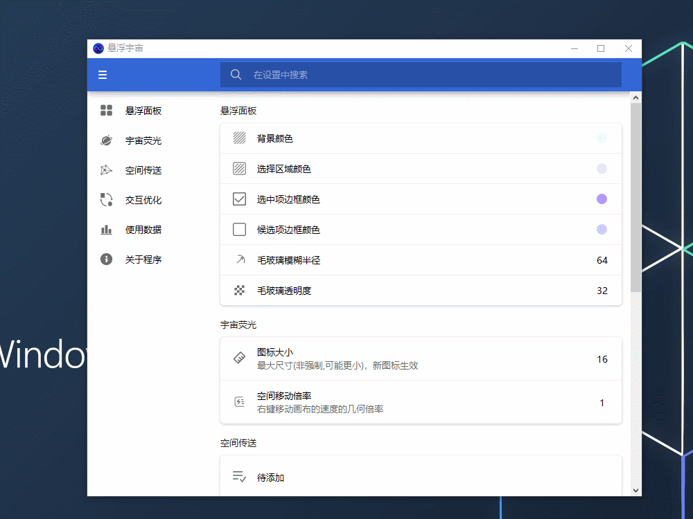
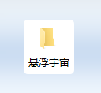
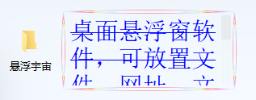

悬浮宇宙
===

桌面悬浮窗软件，可放置文件、网址、文字等多样内容，鼠标贴近屏幕顶边自动呼出。

其特点是**无限尺寸**的画布，如同浩瀚无垠的宇宙，可容纳不限量的数据。

界面简约，动画俏皮，功能丰富，效果甚佳。


## 功能

当前支持的部件类型：

- 文件（快捷方式）
- 文件夹（快捷方式）
- 网站URL（书签）
- 纯文本（速记）
- HTML
- 待办（TODO）
- 图片
- 文件
- 文件夹
- 图片装饰
- 分组小部件


未来计划：

- 导入桌面
- 闹钟提醒
- 传送阵（位置跳转）
- 剪贴板快速触发执行


## 截图


## 操作说明

### 靠边自动唤出

默认位置是屏幕上方边缘，鼠标移到顶出现悬浮面板，鼠标离开自动隐藏。


### 调整位置和大小

悬浮面板的右键菜单中，点击“**固定**”后，面板则不会自动隐藏，可调整位置和大小。

再次点击“固定”，结束调整，继续自动隐藏。




### 添加文件链接

资源管理器中**拖拽文件、文件夹**进来，支持批量添加。

程序会自动获取文件图标和名字，也可手动修改。




### 快速更新文件链接

与添加一样，将资源管理器中的文件**拖拽到相应的图标上**，完成链接更新。

目前仅支持单个替换，对于无法响应的动作（例如图中的多个文件），图标将会轻微震颤。




### 添加和更新网页书签

网页书签和文件一样，在浏览器地址栏中**将网址拖入**，或者**拖到现有图标上**更新链接。

添加时，程序会自动获取网页的图标和标题。




### 添加图像

支持**粘贴**剪贴板的图像，自由调整大小。


### 添加分组背景

为同一类的文件/文件夹/网页添加分组，优化视觉效果。

通过**添加“矩形”**，将之“置于底层+不被选中”，可实现该功能。




### 添加装饰部件

可添加一些用于装饰的小图标，悬浮在面板上。




### 添加装饰背景

可添加一些透明的小图片，置于底层，作为背景装饰。




### 快捷键

- `Ctrl+A`：第一次全选可选中的（不包括设置“不被选中”）的部件；连续的第二次全选所有部件
- `Delete`：删除选中项
- 一些部件（比如“待办”）有自己的快捷键，右键菜单可看到


### 设置样式

绝大多数部件都可以设置CSS样式，但**并非所有部件、所有样式都可使用**，有些属性需要**重启生效**（如选择的线条），请自行测试。

以下是一些对象名字代码，在选择器中使用形如 `#IconLabel{ }` 来设置具体对象，可参考下面一些示例。

- 基础

  - ItemBase：所有部件各自的背景

    ```css
    /* 设置部件背景为白色圆角矩形 */
    #ItemBase { background: white; border-radius: 5px; margin: 3px; }
    ```

    

  - SelectEdge：选中后才出现的背景，修改需重启

    ```css
    /* 设置选择框为宽度为1的红色 */
    #SelectEdge { border: 1px solid #AA0000; }
    ```
    
    

- 链接

  - IconLabel：图标部分
  - TextLabel：文字部分

  ```css
  /* 设置图标背景颜色 */
  #IconLabel { background: white; border-radius: 5px; }
  ```

- 文本

  - TextEdit

    ```css
    /* 设置文字为蓝色宋体、增大、删除线 */
    #TextEdit {
        color: blue;
        font-family: 宋体;
        font-size: 30px;
        text-decoration:line-through;
    }
    ```
    
    
    
    图中的彩色边缘样式：
    
    ```css
    #SelectEdge { background: transparent; border: 5px solid qradialgradient(spread:pad, cx:0.5, cy:0.5, radius:0.5, fx:0.5, fy:0.5, stop:0 rgba(0, 0, 0, 0), stop:0.52 rgba(0, 0, 0, 0), stop:0.565 rgba(82, 121, 76, 33), stop:0.65 rgba(159, 235, 148, 64), stop:0.721925 rgba(255, 238, 150, 129), stop:0.77 rgba(255, 128, 128, 204), stop:0.89 rgba(191, 128, 255, 64), stop:1 rgba(0, 0, 0, 0));}
    ```

- 待办

  - ListWidget：整个列表控件
  - TodoLine：每一行整体
  - TodoCheck：每一行的选择框
  - TodoEdit：每一行的编辑框

- 图像

  - ImageLabel：没必要改，只是个图片

- 矩形

  - 直接使用 ItemBase。设置样式后，将**完全替代**原本的圆角矩形
  
    ```css
    /* 一个横向渐变，如下图 */
    #ItemBase {
        background: qlineargradient(spread:pad, x1:0, y1:0, x2:1, y2:0, stop:0 rgba(255, 178, 102, 64), stop:0.55 rgba(235, 148, 61, 64), stop:0.98 rgba(255, 255, 255, 64), stop:1 rgba(255, 255, 255, 0));
    	border-radius: 5px;
    	margin: 3px;
  }
    ```
    
    


## 附录

1. 渐变样式示例：https://blog.csdn.net/wzs250969969/article/details/78458151